# Booking Chivas Rumberas Medellín

Este proyecto ha sido uno que llevaba varios días en mi mente. Se ha presentado la oportunidad de comenzar a desarrollarlo para la asignatura de Desarrollo Web. A continuación presentaré todas las características y lo que aborda la página de Booking Chivas Rumberas

El proyecto lo escogí para la entrega de Desarrollo Web
Ya que cumple con:

- **Dos cosas relacionables:**  Cada cliente se relaciona a una chiva. Cada chiva se relaciona a una fecha y hora. Cada chiva se relaciona a un recorrido.

- **Catalogo**: Actualmente el catalogo es el de chivas y recorridos está pendiente a implementar (Debo reunirme con el dueño para conocer bien cuales son los que oferta)

- **Formulario con sentido:** El formulario se usa para que los clientes puedan indicar que chiva quieren, el objetivo de la chiva, sus datos de contacto y el tipo de pago que desean.

  

  

    <a href="https://chivas-rumberas-booking.vercel.app/" target="_blank">Chivas Rumberas Booking</a>
  

## Inteligencias Artificiales y Skills

| Herramienta| Skill / Tecnología | ¿Para qué la uso? |
| :--- | :--- | :--- |
| **Gemini** | `Flash-lite 3.5` | Investigación de skills de diseño|
| **Claude** | `Modelo IA base (Claude Sonnet 4.6)` | Ideas de features para el proyecto y recomendación de estructura para las carpetas |
| **Antigravity** | `Nano Banana, agente antigravity`| Mejora de la estética de las imagenes de las chivas. Corregir iluminación y automatizar el nombramiento de las imagenes dentro del proyecto|
| **Vercel** | `v0` | Maquetación de la páginca

### Pendientes Features

- [x] Modo oscuro funcional con toggle en JS que recuerda la preferencia

- [x] Animaciones o transiciones CSS bien logradas (no exageradas)

- [ ] Dominio propio conectado a Vercel (no solo *.vercel.app)	

- [x] Formulario que realmente envía (Formspree, Web3Forms u similar)

- [x] Accesibilidad cuidada: navegable por teclado, buen contraste, alt reales

---

### Pendientes Documentación

[x] Descripción del proyecto: qué es, para quién, qué problema resuelve.

[x] Link al sitio en Vercel.

- [x] Capturas de la página en móvil y escritorio.

- [x] Decisiones técnicas — responde estas preguntas en párrafos cortos:

- ¿Dónde usaste Flexbox y dónde Grid, y por qué en cada caso?

- ¿Qué hace tu JavaScript, explicado sin copiar el código? ¿Cómo funciona tu validación?

- Si usaste IA, ¿para qué la usaste y qué cambiaste tú del resultado?
¿Qué fue lo más difícil y cómo lo resolviste?

---

## Descripción del proyecto

**¿Qué es?**

Esta plataforma es una landing page y booking de chivas rumberas en la ciudad de Medellín.

Identifiqué que era necesaria esta plataforma, pues en el mercado hay varias landing page sobre chivas en al ciudad, pero ninguna para agendarlas directamente en la página. Todo el proceso que se tenía era manual. 

Mi objetivo con esta página es automatizar este proceso, brindando mayor facilidad para los dueños de chivas y los clientes que quieren una atención más rápida.

Este proyecto puede tener un enfoque a largo plazo como un SAAS. Ofrecer la herramienta para todos los dueños de chivas que quieran expandirse y llegar a más personas por medios digitales y que los clientes tengan la facilidad de agendar.

**¿Para quien es?**

Este proyecto nace como un proyecto personal que me propuso un amigo. El lleva varios años en el negocio de las chivas y me explicó que ***todos*** sus colegas llegan a sus clientes por el voz a voz. No cuentan con paginas web (muy pocas) y no hacen uso de las redes sociales.

**¿Qué problema resuelve?**

Este proyecto nace para llegar con mayor facilidad a un público de clientes muy diverso. Desde jóvenes y adultos que quieren salir de fiesta y disfrutar con amigos y familia, como tambien para turistas que quieren conocer los lugares más lindos de Antioquia.

Esta plataforma permiten que puedan agendar las chivas con mayor facilidad y que a su vez los dueños de las chivas vean incrementadas sus ventas al poder agilizar el proceso de agendamiento y de una forma más organizada.

---

## Capturas de la página (Escritorio y Móvil)

### Vista Escritorio (Desktop)

| Sección | Captura |
| :--- | :--- |
| **Hero** | 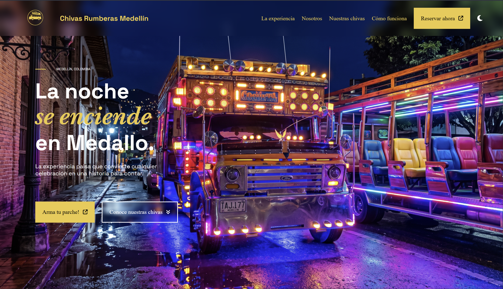 |
| **La Experiencia** | 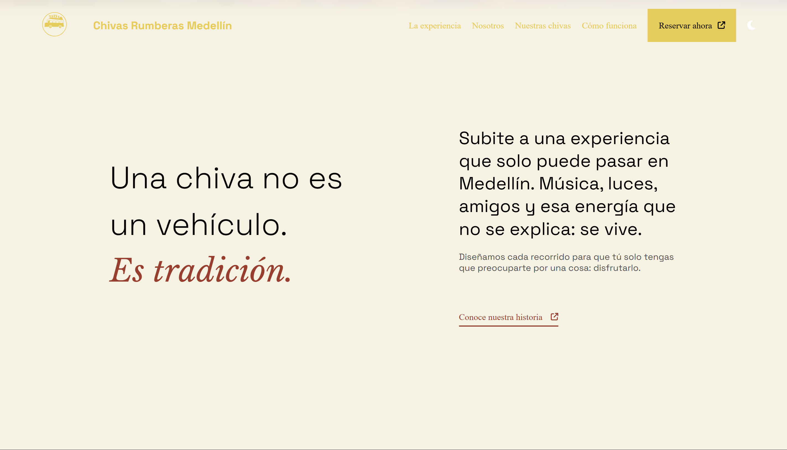 |
| **¿Por qué nosotros?** | 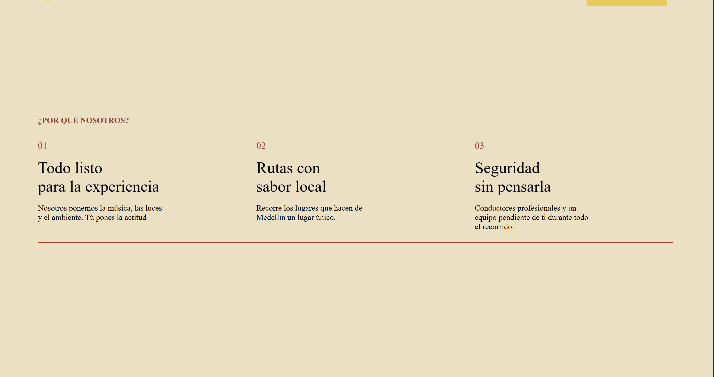 |
| **Nuestras Chivas** | 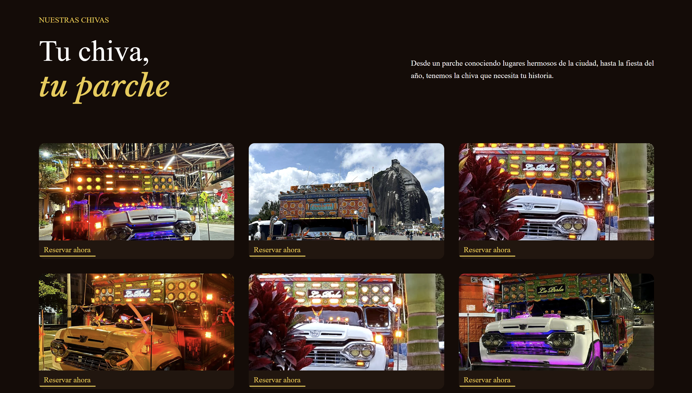 |
| **Cómo Funciona** | 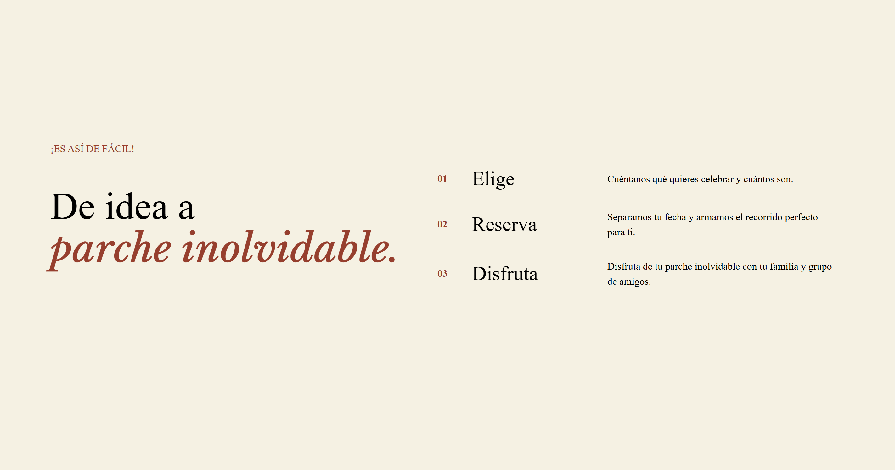 |
| **Estadísticas (Stats)** |  |
| **Momentos** |  |
| **Formulario Booking** | 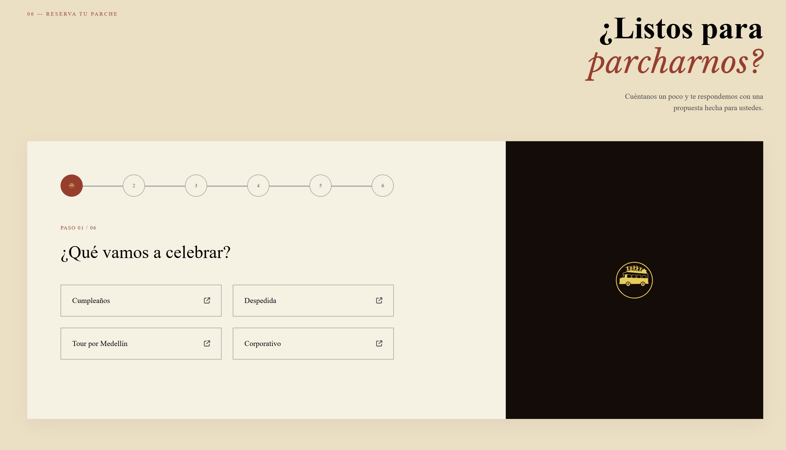 |
| **Footer** |  |

 

### Vista Móvil (Mobile)

| Sección | Captura |
| :--- | :--- |
| **Hero** | 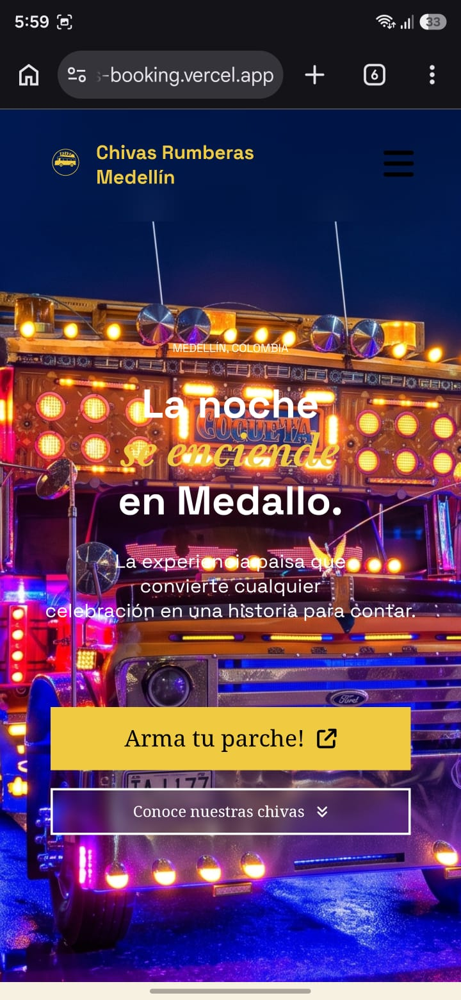 |
| **Menú Hamburguesa** | 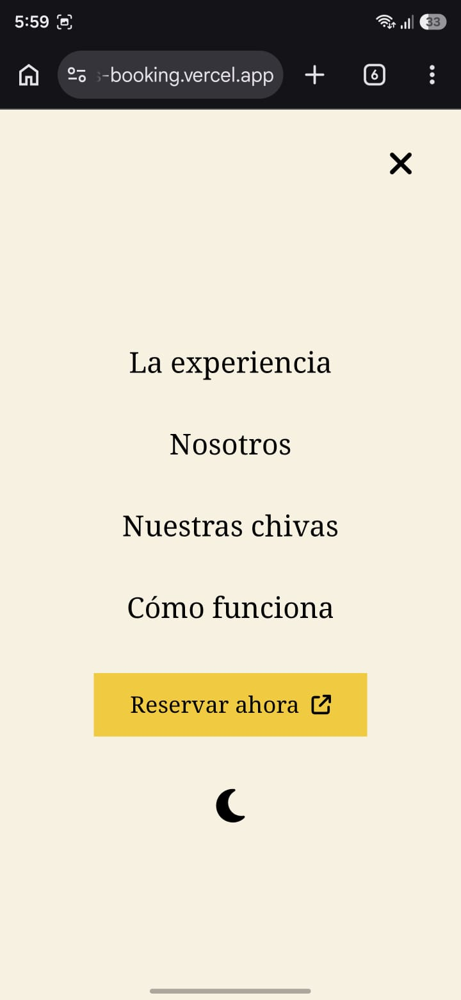 |
| **La Experiencia** | 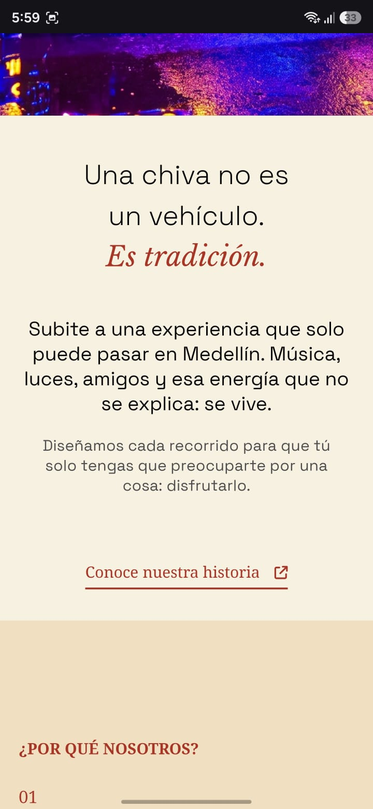 |
| **¿Por qué nosotros?** | 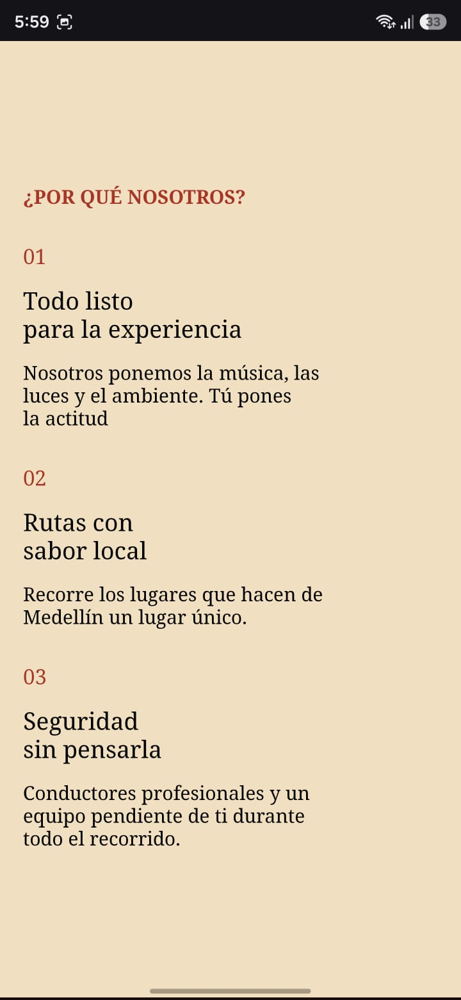 |
| **Nuestras Chivas** | 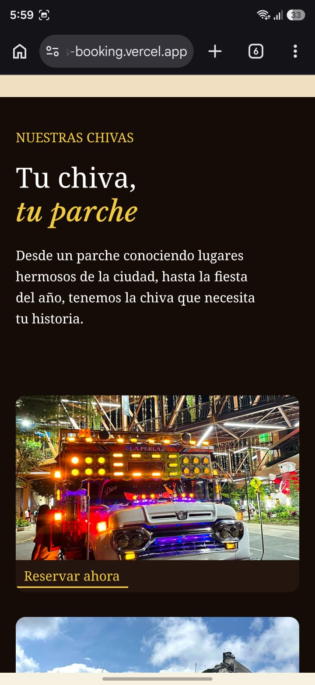 |
| **Cómo Funciona** | 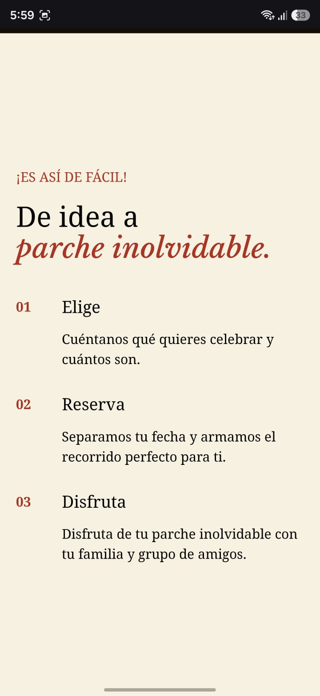 |
| **Estadísticas (Stats)** | 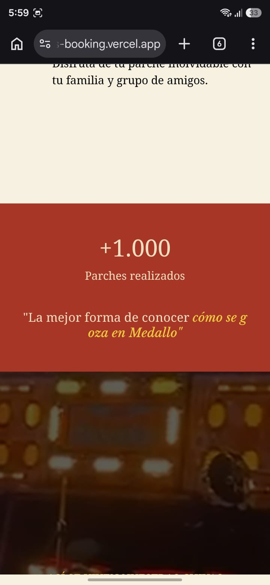 |
| **Momentos Video** | 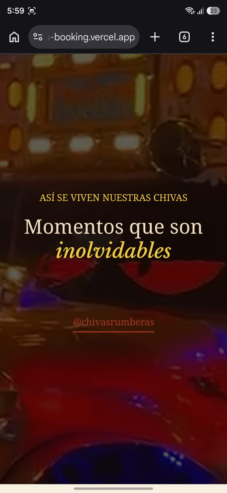 |
| **Formulario Booking** | 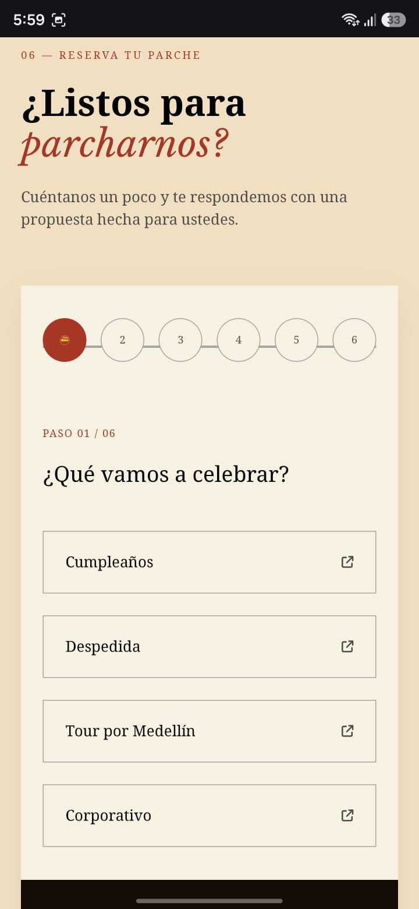 |
| **Footer** | 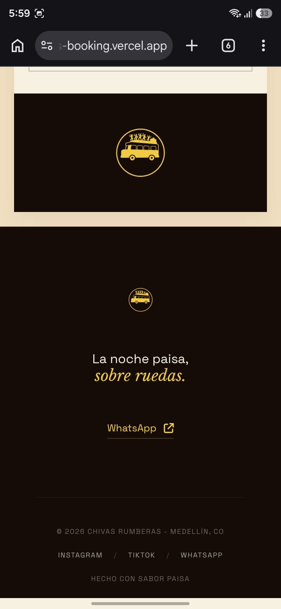 |

---

## Decisiones Técnicas y Preguntas

### ¿Dónde hago uso de Flexbox y dónde Grid, y por qué en cada caso?
En la gran mayoría de secciones se hace uso de Flexbox para posicionar los elementos. La excepción la hice en la sección ***Cómo funciona*** (`.steps`). Pues al utilizar Flexbox, al tener varias palabras de longitud diferente, el contenedor se adaptaba y quedaba disparejo: unas palabras estaban más a la derecha, mientras que las otras más a la izquierda. Esto lo resolví con Grid, asignando un ancho fijo para cada una de las 3 columnas que puse en el grid, lo que hizo que las palabras se alinearan perfectamente.

También en la ***galería de chivas*** (`.chivas__gallery`) hago uso de Grid, pues es mucho más sencillo para que se adapte la cantidad de imágenes acorde al **width** disponible.

### ¿Qué hacen los archivos JavaScript, explicado sin copiar el código? ¿Cómo funciona la validación?
- **En mi archivo `main.js`** (es el más largo, en las siguientes entregas refactorizaré esto):
  - Se encarga de agregar o quitar ciertas clases de las etiquetas HTML para jugar con el CSS. Por ejemplo con los toggle (modo oscuro) o el menú hamburger.

  - **Lógica de la galería**: Hay un JSON con la ruta de las fotos y una función que hace un **forEach** por cada ruta y añade a mi HTML una card nueva con la ruta de la chiva del JSON.

  - **Lógica del formulario de booking**: Un JSON con el título del campo, tipo de dato y las opciones. Esto me simplifica bastante el HTML que debo de crear en el `index.html`. Luego con una función simplemente agrego al HTML. En esta misma sección del JS hago la validación; dependiendo en qué step se encuentre, se agregan o quitan ciertos estilos de los elementos (esto es todo visual).

  - **Validación de inputs**: Valido los inputs del usuario en el formulario. En el input ***name*** debe ser mayor a 3 caracteres. En el ***correo*** valido con una expresión regex para que contenga sí o sí `@`, un dominio y punto (.). El ***teléfono*** debe tener mínimo 7 números.

  - **Envío del formulario**: Como usé en el `action` del formulario `formspree.io`, al hacer submit del formulario la data me llega a mi usuario de dicha plataforma.

- **En el archivo `animations.js`**:
  - Hago uso de la librería de GSAP que me permite hacer animaciones más personalizadas. Registro el ScrollTrigger que es para detectar cuando se hace scroll y ya modifico aquellos elementos con ciertas clases para que tengan un determinado comportamiento (desde que al hacer scroll haga ***-100%*** en el eje y para esconder el navbar).
  - En el título le pongo una animación de ***bounce.out*** y le digo que caiga desde `-50` en el eje y.
  - En los subtítulos le hago un ***for*** a cada letra, hago un reset para poner "invisibles" las letras antes de empezar la animación y con un `stagger` pongo el tiempo entre la animación de cada letra.
  - Para la animación de los stats, es un parámetro que paso al método de GSAP. Este método es el de counter, y luego le digo cuánto quiero que se tarde.

### Uso de IA, ¿para qué la usé y qué cambié del resultado?
- Usé la IA para hacer el diseño. Usé la IA **v0 de Vercel**. Le pedí que me ayudara con todo lo relacionado al diseño, le di el enfoque que quería, público objetivo, restricciones, y casos de buen UX y UI. Esta IA generó una maqueta del diseño que utilicé para guiarme.
- Usé la IA en el formulario, pues quería que tuviera una disposición y comportamiento diferente a los que normalmente se hacen que no cuentan con "steps". Yo le modifiqué la disposición, pues en un inicio me dio un resultado todo en columna y no me gustó. Lo modifiqué en base a mi gusto personal que considero que se ve mucho mejor.
- También usé IA para el diseño responsive. En este caso no hice ningún cambio, pues lo único que hizo la IA fue que dependiendo el tamaño de la pantalla del dispositivo cambiara ciertos tamaños y comportamientos de las clases.

### ¿Qué fue lo más difícil y cómo lo resolviste?
El formulario del booking me estaba costando mucho tiempo y no me estaba gustando cómo quedaba. Finalmente tomé la decisión de decirle a la IA que siguiendo ciertas instrucciones lo mejorara y adaptara. Considero que el resultado que me dio fue bastante bueno; modifiqué solamente lo visual para una mejor disposición de las cosas. Finalmente con la implementación de **formspree.io** considero que el formulario de momento cumple su cometido (falta implementar todo el backend).

---

Finalmente quiero añadir que este proyecto a pesar de que teníamos libertad de usar IA, decidí usar lo más mínimo. Lo que más usé fue en el diseño y en el formulario. De resto, toda la página fue creada por mí mismo, con mi lógica. Fue un proceso que me entretuvo mucho y disfruté todo el proceso.

